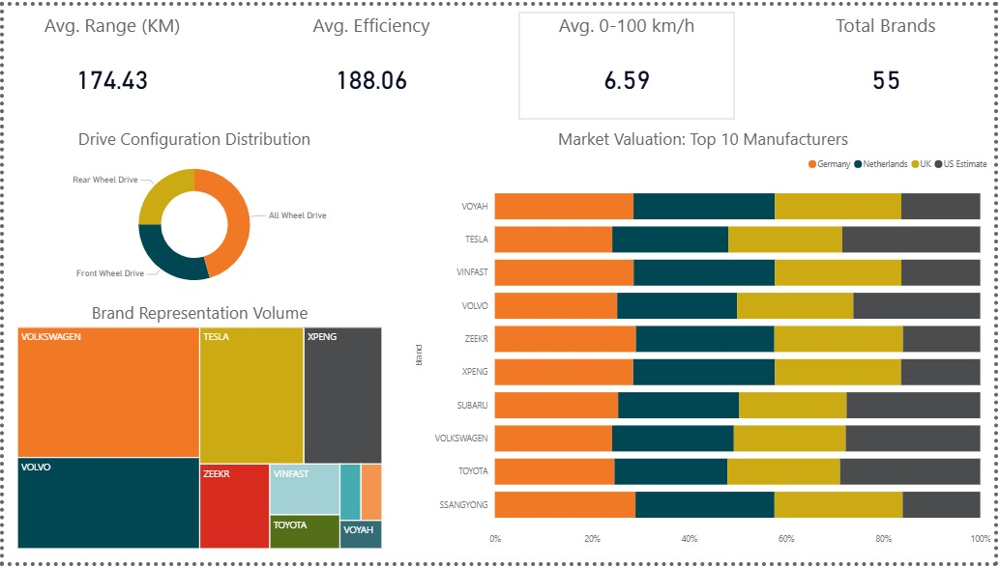

# ⚡ Electric Vehicle Market Dashboard — Power BI

A multi-page Power BI dashboard exploring the global EV market across performance, pricing, and value metrics. Built as a portfolio project using a real-world dataset of electric vehicles with specs, range, efficiency, and multi-market pricing.

---

## 📊 Dashboard Pages

| Page | Status | Description |
|------|--------|-------------|
| Market Overview | 🚧 WIP | KPI cards, drive config donut, brand treemap, market valuation stacked bar |
| Performance Explorer | 🚧 TBD | Battery vs range scatter, speed comparisons, fastcharge rankings |
| Price vs Value Analysis | 🚧 TBD | Multi-market pricing, DAX value score, best-value model matrix |

---

## 🗂️ Dataset

The dataset covers a range of EV models with the following fields:

| Column | Description |
|--------|-------------|
| `Brand` / `Model` | Vehicle identity |
| `Battery` | Battery capacity (kWh) |
| `KM_of_range` | Estimated real-world range (km) |
| `0-100` | Acceleration 0–100 km/h (seconds) |
| `Top_speed` | Top speed (km/h) |
| `Efficiency` | Energy consumption (Wh/km) |
| `Fastcharge` | Fast charging speed (km/h added) |
| `Germany_price_before_incentives` | List price in Germany (€) |
| `Netherlands_price_before_incentives` | List price in Netherlands (€) |
| `UK_price_after_incentives` | Price in UK after government incentives (£) |
| `Estimated_US_Value` | Estimated US market value ($) |
| `Drive_Configuration` | RWD / FWD / AWD |
| `Towbar_possible` | Whether a towbar can be fitted |
| `Towing_capacity_in_kg` | Max towing capacity |
| `Number_of_seats` | Seating capacity |

> Prices are pre-incentive except for the UK column. Keep this in mind when comparing markets directly.

---

## 🔍 Page 1 — Market Overview

**Status: 🚧 Work in Progress**

A high-level snapshot of the EV market intended for quick executive-style reading.

**Visuals included:**
- KPI cards — avg range (km), avg efficiency (Wh/km), avg 0–100 km/h, total brands
- Donut chart — drive configuration distribution (AWD / RWD / FWD) with count and percentage labels
- Treemap — brand representation volume, sized by number of models in the dataset
- 100% stacked bar chart — market valuation split across Germany, Netherlands, UK, and US Estimate for the top 10 manufacturers



---

## 🏎️ Page 2 — Performance Explorer

**Status: 🚧 Work in Progress**

An interactive deep-dive into vehicle specs, designed to highlight scatter plot work and tooltip drill-through.

**Planned visuals:**
- Scatter plot — battery capacity vs range, colored by brand
- Bubble chart — top speed vs 0–100, bubble size = battery
- Ranked column chart — fastcharge speed by model
- Line chart — efficiency trend across battery sizes
- Tooltip page — hover on any model to see a full spec card
- Range slicer — filter by km range or price band

---

## 💰 Page 3 — Price vs Value Analysis

**Status: 🚧 Work in Progress**

Multi-market pricing comparison with a custom DAX value score to identify the best value EVs.

**Planned visuals:**
- Clustered bar — side-by-side prices per model across DE / NL / UK / US
- Scatter plot — price vs km range to surface outliers
- Matrix table — conditional formatting highlights cheapest market per model
- Towing filter — segment by towbar availability and capacity

**DAX measures planned:**
```DAX
Value Score = DIVIDE([Avg KM Range], [Avg Price], 0) * 1000
Price Spread = [Max Market Price] - [Min Market Price]
```

> Markets are unpivoted in Power Query from 4 price columns into a `Market / Price` structure for cleaner filtering.

---

## 🛠️ Tools & Techniques

- **Power BI Desktop** — report authoring
- **Power Query** — data shaping, unpivoting price columns
- **DAX** — custom measures for value scoring and price comparisons
- **Conditional formatting** — matrix color scale for price comparison
- **Drill-through** — model-level detail page (Page 2)
- **Bookmarks** — toggle between all models / best value only (Page 3)

---

## 🚀 How to Open

1. Clone or download this repository
2. Open the `.pbix` file in [Power BI Desktop](https://powerbi.microsoft.com/desktop/)
3. No data gateway or credentials required — data is embedded

---

## 📁 Repository Structure
```
ev-powerbi-dashboard
 ┣ 📊 dashboard.pbix        # Main Power BI file
 ┣ 📁 data
 ┃ ┗ 📄 cars_data_cleaned.xlsx      # Source dataset
 ┣ 📁 images
 ┃ ┗ 🖼️ page1_market_overview.png      # Dashboard preview images
 ┗ 📝 README.md
```
---

## 🙋 Author

Built by **Athul Rohan** as part of a data analytics portfolio.  
Data from Kaggle: https://www.kaggle.com/datasets/vanillatyy1/electric-vehicle-dataset
