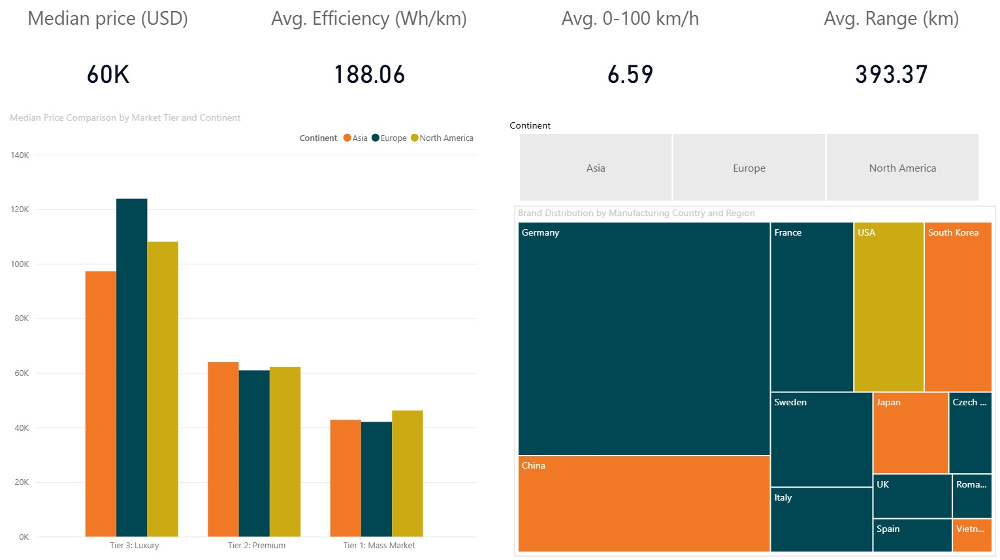

# ⚡ Global Electric Vehicle Market Analysis

> A Power BI dashboard exploring the global EV market across performance, pricing, and value metrics. Built on a real-world dataset of electric vehicles with specs, range, efficiency, and multi-market pricing..

---

## 📸 Dashboard Preview



---

## 📁 Repository Structure

```
├── data/
│   ├── cars_data_cleaned.xlsx          # The dataset
│   └── extra_sheet(s).xlsx             # Supplementary mapping file
│       └── brand_country_mapping       # Brand → Country → Continent
├── assets/
│   └── market_overview_dashboard.jpeg  # Dashboard screenshot
├── dashboard.pbix                      # Power BI report file
└── README.md
```

---

## 🗂️ Dataset

- **Source:** [Electric Vehicle Dataset 2024 — Kaggle](https://www.kaggle.com/)
- **Origin:** EV Database — April 2024 web scrape

### Columns

| Column | Description |
|--------|-------------|
| `Row_ID` | Unique identifier for each record |
| `Brand` / `Model` | Vehicle brand and model name |
| `Drive_Configuration` | RWD / FWD / AWD |
| `Battery` | Battery capacity (kWh) |
| `RangeValue` | Price per km of range (€) — combines affordability and range; lower is better |
| `Range` | Estimated real-world range (km) |
| `Efficiency` | Energy consumption (Wh/km) |
| `0-100` | Acceleration 0–100 km/h (seconds) |
| `Top_speed` | Top speed (km/h) |
| `Fastcharge` | Fast charging speed (km/h added) |
| `Number_of_seats` | Seating capacity |
| `Towbar_possible` | Whether a towbar can be fitted (Yes/No) |
| `Towing_capacity_in_kg` | Maximum towing capacity (kg) |
| `Germany_price_before_incentives` | List price in Germany before incentives (€) |
| `Netherlands_price_before_incentives` | List price in Netherlands before incentives (€) |
| `UK_price_after_incentives_EUR` | Price in UK after government incentives (converted to EUR) |
| `Approx_price_in_USD` | Approximate price in the US market (USD) |

> **Note:** All prices except the UK column are before incentives. The UK price is post-incentive and converted to EUR. The USD price is an approximation based on the German list price.

### Supplementary File — `extra_sheet(s).xlsx`

| Column | Description |
|--------|-------------|
| `No.` | Row number |
| `Brand` | Vehicle brand name |
| `Country` | Country of brand origin |
| `Continent` | Continent grouping (Asia / Europe / North America) |

---

## 📊 Dashboard — Market Overview

Built in **Power BI Desktop**, loaded directly from `cars_data_cleaned.xlsx` enriched with the brand–country mapping.

**KPI Cards:** Median Price (USD) · Avg. Efficiency (Wh/km) · Avg. 0–100 km/h · Avg. Range (km)

**Visuals:**
- **Grouped bar chart** — Median price by market tier and continent, segmented across Asia, Europe, and North America
- **Treemap** — Brand count by country and continent, revealing the geographic distribution of EV manufacturers

**Key Insight:**

> The global EV landscape is defined by a two-pronged competitive structure: European manufacturers successfully defend the high-margin Luxury Tier ($120K+ median) through brand heritage, while Asian manufacturers leverage cost-efficiencies to dominate the Mass Market and Premium volume segments. North American players maintain a unique "middle-ground" position, matching European luxury pricing but trailing in total brand diversity.

---

## 🛠️ Tech Stack

| Tool | Purpose |
|------|---------|
| Power BI Desktop | Dashboard development & visualisation |
| Excel | Supplementary brand–country mapping |
| Kaggle | Source dataset |

---

## 🚀 Getting Started

Open `dashboard.pbix` on Power BI Desktop.

---

## 📄 License

This project is for educational and portfolio purposes. The underlying dataset is sourced from Kaggle — please refer to the original dataset page for its license terms.
